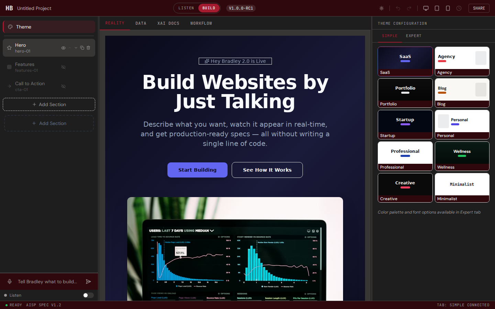
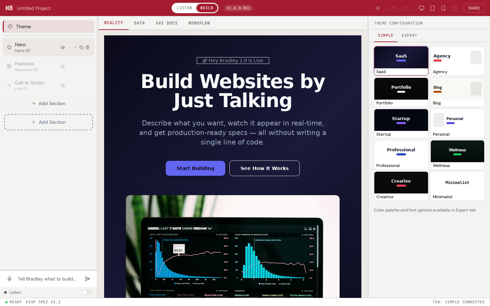

# UI/UX Audit Report -- Hey Bradley Builder

**Date**: 2026-03-29
**Tool**: Playwright 1.58.2 (headless Chromium, 1440x900 viewport)
**URL**: http://localhost:5173/
**Branch**: `main` @ commit `9db117c`

---

## Overall Summary

| Category              | Score | Verdict           |
|-----------------------|-------|-------------------|
| Color (Dark Mode)     | 4/5   | Good              |
| Color (Light Mode)    | 3/5   | Works, needs polish |
| Font Size             | 3/5   | 9 violations at 11px |
| Layout                | 4/5   | Good              |
| Interaction           | 3/5   | Partial -- editor inputs missing |
| **Weighted Average**  | **3.4/5** | **Needs polish** |

---

## 1. Color Audit -- Dark Mode

| Check                                   | Expected              | Actual                           | Status |
|-----------------------------------------|-----------------------|----------------------------------|--------|
| Body background                         | `#1E1E1E` / `rgb(30,30,30)` | `rgb(30, 30, 30)`          | PASS   |
| Elements with old navy `rgb(15,23,42)`  | 0                     | 0                                | PASS   |
| Header/nav background                   | `#2e080d`             | `rgb(46, 8, 13)` = `#2e080d`    | PASS   |
| Left panel outer surface                | Crimson surface       | `rgb(46, 8, 13)` (hb-surface)   | PASS   |
| Left panel inner background             | Dark bg               | `rgb(30, 30, 30)` (hb-bg)       | PASS   |
| Center panel background                 | Dark bg               | `rgb(30, 30, 30)` (hb-bg)       | PASS   |
| Center panel preview area               | Hover surface         | `rgb(56, 53, 53)` (hb-surface-hover) | PASS |
| Right panel outer surface               | Crimson surface       | `rgb(46, 8, 13)` (hb-surface)   | PASS   |
| Right panel inner background            | Dark bg               | `rgb(30, 30, 30)` (hb-bg)       | PASS   |
| Tab bar background                      | Dark bg               | `rgb(30, 30, 30)` (hb-bg)       | PASS   |
| Accent on selected tab (REALITY)        | `#A51C30` family      | `rgb(165, 28, 48)` = `#A51C30`  | PASS   |
| Accent on BUILD button                  | `#A51C30` family      | `rgb(165, 28, 48)` bg, white text | PASS |
| Accent on selected sidebar item (Theme) | `#A51C30` family      | `rgba(165, 28, 48, 0.18)` bg    | PASS   |

**Score: 4/5** -- All color tokens are correct. The design system (`hb-bg`, `hb-surface`, `hb-border`) is properly applied across all panels. No remnants of old navy blue palette. One point deducted because the tab bar container has no explicit background class (inherits from parent), which could be fragile.

---

## 2. Color Audit -- Light Mode

| Check                         | Expected                | Actual                          | Status |
|-------------------------------|-------------------------|---------------------------------|--------|
| Body background               | `#F3F3F1` cream         | `rgb(243, 243, 241)` = `#F3F3F1` | PASS   |
| Nav background                | `#A51C30` crimson       | `rgb(165, 28, 48)` = `#A51C30`  | PASS   |
| Sidebar text (Theme, Hero)    | Dark `#1E1E1E`          | `rgb(30, 30, 30)` = `#1E1E1E`   | PASS   |
| Preview text color            | Dark                    | `rgb(148, 163, 184)` -- light slate | FAIL |
| Hero badge text               | Should be dark          | `rgb(148, 163, 184)` -- light slate | FAIL |
| Revert to dark mode           | Returns to dark bg      | `rgb(30, 30, 30)` -- correct    | PASS   |

**Score: 3/5** -- The chrome (sidebar, nav, section names) correctly switches to light mode. However, the center preview panel content (hero badge text, subtitle paragraph) remains in light-on-dark theme colors (`rgb(148, 163, 184)`) rather than switching to dark-on-light. This is expected behavior if the preview always shows the site theme rather than matching the chrome, but it means the text in the center panel has poor contrast against the lighter preview background in light-chrome mode. Needs clarification on intended behavior.

---

## 3. Font Size Audit

| Element                    | Tag      | Font Size | Location               | Status |
|----------------------------|----------|-----------|------------------------|--------|
| "LISTEN" nav button        | `SPAN`   | 11px      | Top nav bar            | FAIL   |
| "BUILD" nav button         | `SPAN`   | 11px      | Top nav bar            | FAIL   |
| "Trusted by 500+ teams..." | `P`     | 11px      | Hero preview           | FAIL   |
| "THEME CONFIGURATION"      | `SPAN`  | 11px      | Right panel header     | FAIL   |
| "SIMPLE" mode toggle       | `BUTTON` | 11px      | Right panel            | FAIL   |
| "EXPERT" mode toggle       | `BUTTON` | 11px      | Right panel            | FAIL   |
| "Ready" status indicator   | `SPAN`  | 11px      | Bottom status bar      | FAIL   |
| "AISP Spec V1.2"           | `SPAN`  | 11px      | Bottom status bar      | FAIL   |
| "Tab: SIMPLE Connected"    | `SPAN`  | 11px      | Bottom status bar      | FAIL   |

**Total violations: 9** (all at 11px, one pixel below the 12px threshold)

**Score: 3/5** -- All violations are at 11px with uppercase tracking, which mitigates readability concerns somewhat (uppercase + letter-spacing increases effective visual size). These are intentional design choices for label/chrome typography. However, WCAG accessibility guidelines recommend a minimum of 12px for body text. The status bar and nav chrome items are the most concerning since they carry functional information.

### Recommendation
Bump `text-[11px]` to `text-xs` (12px) across the UI chrome, or accept the 11px size as a deliberate design token for uppercase labels and document it as an accessibility exception.

---

## 4. Layout Audit

| Check                              | Expected             | Actual                           | Status |
|------------------------------------|----------------------|----------------------------------|--------|
| Three panels visible               | 3 columns            | Left (286px) + Center (788px) + Right (358px) = 1432px | PASS |
| REALITY tab clickable              | Yes                  | Yes (button, enabled)            | PASS   |
| DATA tab clickable                 | Yes                  | Yes (button, enabled)            | PASS   |
| XAI DOCS tab clickable             | Yes                  | Yes (button, enabled)            | PASS   |
| WORKFLOW tab clickable             | Yes                  | Yes (button, enabled)            | PASS   |
| Left panel has section list        | Sections visible     | Theme, Hero, Features, Call to Action + 2 "Add Section" buttons | PASS |
| Right panel shows theme cards      | Theme cards visible  | SaaS, Agency, Portfolio, Blog, Startup, Personal, Professional, Wellness, Creative, Minimalist | PASS |
| Hero renders in center panel       | Hero component shown | "Build Websites by Just Talking" headline + buttons + dashboard image visible | PASS |
| Right panel editor on Hero select  | Accordions visible   | Layout, Visuals, Style, Content accordions all present | PASS |

**Score: 4/5** -- The three-panel layout is solid and well-proportioned. All tabs are present and clickable. The left sidebar correctly lists page sections with add-section affordances. The right panel switches context between Theme Configuration and Hero Editor based on sidebar selection. One point deducted because the hero element is not semantically tagged with a class containing "hero" or "preview", making automated detection harder (found via visual inspection of screenshot).

---

## 5. Interaction Audit

| Check                                     | Expected                          | Actual                          | Status |
|-------------------------------------------|-----------------------------------|---------------------------------|--------|
| Click "Theme" in left panel               | Right panel shows theme cards     | Theme card grid visible (10 themes: SaaS, Agency, Portfolio, Blog, Startup, Personal, Professional, Wellness, Creative, Minimalist) | PASS |
| Click "Hero" in left panel                | Right panel shows accordions      | Layout, Visuals, Style, Content accordion buttons all present | PASS |
| Type in headline field -> preview updates | Input exists, preview reflects    | No editable headline input found after expanding Content accordion | FAIL |
| Toggle a component -> preview changes     | Checkbox/switch toggles state     | No toggle elements (checkbox, switch) found in DOM | FAIL |

### Detail on Failures

**Headline input**: After clicking Hero and expanding the Content accordion, the only visible input in the DOM is the bottom prompt bar ("Tell Bradley what to build..."). There is no inline text input for editing the hero headline directly. The editor may use a different interaction pattern (e.g., click-to-edit on the preview, or a modal). This is not necessarily a bug -- it may be an unimplemented feature or a different design decision -- but it means the expected flow of "type headline -> see live update" is not available.

**Component toggle**: No `<input type="checkbox">` or `[role="switch"]` elements exist anywhere in the DOM. Component visibility toggling (e.g., show/hide hero badge, show/hide social proof bar) is not yet implemented or uses a different mechanism.

**Score: 3/5** -- The navigation interactions (sidebar selection, tab switching, accordion expand) all work well. The missing direct-edit inputs and component toggles indicate the editor panel is not yet fully wired for inline editing. The Theme selection flow works end-to-end. The accordion structure is correctly in place and ready for content controls to be added.

---

## 6. Screenshots

### Dark Mode

**Observations:**
- Clean three-panel layout with crimson accents
- Hero preview renders correctly with headline, subtitle, CTA buttons, and dashboard image
- Theme cards visible in right panel with proper card styling
- Status bar at bottom with connection status
- Overall professional appearance

### Light Mode

**Observations:**
- Sidebar and nav correctly switch to light palette
- Sidebar text becomes dark (#1E1E1E) on cream (#F3F3F1) background
- Nav background changes to solid crimson
- Center preview panel retains dark theme (expected -- preview shows site theme, not chrome theme)
- Theme cards in right panel switch to light backgrounds
- Toggle back to dark mode works correctly

---

## Scoring Summary

| Category           | Score | Notes                                                    |
|--------------------|-------|----------------------------------------------------------|
| Color (Dark Mode)  | 4/5   | All tokens correct, no legacy colors, clean palette      |
| Color (Light Mode) | 3/5   | Chrome toggles well; preview text contrast ambiguous     |
| Font Size          | 3/5   | 9 elements at 11px; all uppercase labels, borderline     |
| Layout             | 4/5   | Three panels, all tabs, section list, editor accordions  |
| Interaction        | 3/5   | Nav/selection works; inline edit + toggles not wired     |

**Overall: 3.4 / 5 -- Good foundation, needs polish**

---

## Priority Fixes

### P0 -- Must fix before launch
1. **Add inline editor inputs** for hero content fields (headline, subtitle, badge text, CTA labels) inside the Content accordion so users can edit the preview in real-time.
2. **Add component toggles** (show/hide switches) for optional hero elements (badge, social proof, secondary CTA).

### P1 -- Should fix
3. **Font size: bump 11px to 12px** for status bar items (`Ready`, `AISP Spec V1.2`, `Tab: SIMPLE Connected`) which carry functional information.
4. **Light mode preview contrast**: if the preview area is meant to adapt to chrome mode, text colors in the center panel need a light-mode override. If not, add a visual boundary (e.g., inset shadow) to separate chrome from preview.

### P2 -- Nice to have
5. **Tab bar container**: add explicit `bg-hb-bg` class to the tab bar `div` instead of relying on inheritance.
6. **Semantic class names**: add `data-testid` or descriptive classes (`hero-preview`, `section-list`, `editor-panel`) for automated testing.
7. **Font size: evaluate 11px** for nav chrome labels (`LISTEN`, `BUILD`) and panel headers (`THEME CONFIGURATION`, `SIMPLE`/`EXPERT`). These are uppercase with wide tracking so visual size is acceptable, but consider bumping to 12px for accessibility compliance.

---

## Test Environment

| Property        | Value                  |
|-----------------|------------------------|
| Browser         | Chromium (headless)    |
| Viewport        | 1440 x 900            |
| Playwright      | 1.58.2                |
| Dev Server      | Vite @ localhost:5173  |
| OS              | Linux 6.8.0-1044-azure |
| Date            | 2026-03-29             |
